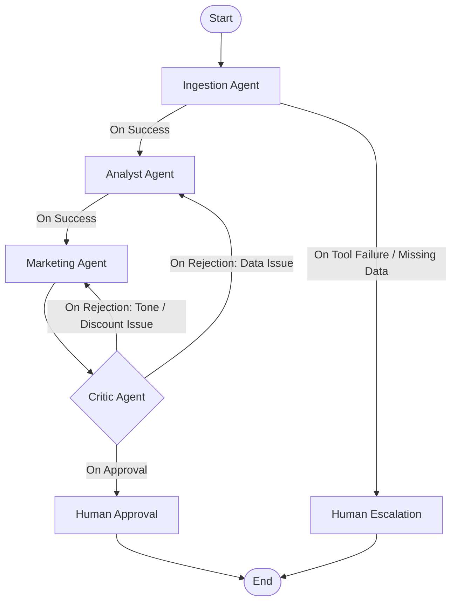

# Micro Entrepreneur Growth Worker

A lightweight multi-agent assistant built for small Indian shop owners (like Kirana stores and local retailers). It analyzes daily sales, spots revenue drops, identifies customers who stopped visiting, and drafts personalized WhatsApp offers in Rupees (₹) to bring them back.

---

## Key Features

- **Weekly Sales Review**: Compares current weekly sales against last month's data to show whether revenue went up or down in ₹.
- **Lapsed Customer Detection**: Finds regular customers who have not visited recently and lists what they usually buy.
- **Slow-Moving Stock Alerts**: Flags items that are not selling and suggests simple bundle offers to clear dead stock.
- **WhatsApp Follow-up Drafts**: Writes short, polite messages starting with "Namaste" (under 50 words, maximum 20% discount).
- **Self-Correction Loop**: An automated QA Critic agent checks generated messages for missing ₹ symbols, excessive discounts, or bad formatting, and sends them back for correction before presenting them.
- **Local Data Privacy**: Real customer names and phone numbers stay on your local machine in SQLite. Only masked IDs (like `C001`) are shared with the LLM.
- **Human in the Loop**: The tool never sends messages or makes changes on its own. You review and approve everything first.
- **Web Dashboard**: Clean browser interface to log daily sales, view revenue charts, inspect transactions by date, and open pre-filled WhatsApp links.
- **Automated Testing Suite**: Built-in test runner that checks bad CSV files, privacy rules, agent loops, and evaluates how much money the tool can save or recover for the shop.

---

## How It Works



1. **Ingestion Agent**: Reads your sales CSV file, checks for required columns, and masks sensitive customer info (names and phone numbers).
2. **Analyst Agent**: Queries the local SQLite database, calculates revenue trends against a 30-day baseline, and identifies lapsed customers and slow-moving items.
3. **Marketing Agent**: Drafts targeted WhatsApp offers based on what each customer prefers to buy.
4. **QA Critic Agent**: Checks every draft against business rules (uses ₹ symbol, discount is 20% or less, message is under 50 words). If a draft fails, it loops back to the marketing agent with feedback.
5. **Human Approval**: The system unmasks the customer names on your screen so you can review, edit, and approve the drafts before saving.

---

## Setup and Running

### 1. Install dependencies
Make sure you have Python 3.10 or newer installed:
```bash
pip install -r requirements.txt
```

### 2. Configure your API key
Create a `.env` file in the project root:
```env
GEMINI_API_KEY=your_gemini_api_key_here
```
You can get a free key from Google AI Studio.

### 3. Start the application
```bash
python src/main.py
```
Open your browser and navigate to: `http://127.0.0.1:8000`

### 4. CLI mode (optional)
To run the analysis directly in the terminal without opening the browser:
```bash
python src/main.py --cli
```

### 5. Running tests
You can test the entire project to make sure all features and guardrails are working properly:

- **Run all tests in the terminal**:
  ```bash
  python run_tests.py
  ```
- **Run tests for a specific feature**:
  ```bash
  python run_tests.py --suite csv       # Test wrong CSV formats and corrupted data
  python run_tests.py --suite impact    # Test shop revenue recovery calculations
  python run_tests.py --suite marketing # Test WhatsApp message rules and discount limits
  ```
- **Run using pytest**:
  ```bash
  pytest tests/ -v
  ```
- **Run from the browser**:
  Open `http://127.0.0.1:8000` and click "Run All System Tests & Shop Impact Analysis" in Section 7 of the dashboard.

---

## What the Tests Check

- **Wrong CSV formats**: Tests how the system handles files with missing headers (like missing prices or items), non-numeric amounts (like words instead of numbers), extra commas, empty files, or missing files. It makes sure bad data is stopped before it touches the database.
- **Customer privacy**: Verifies that real names and phone numbers are converted to customer IDs (like `C001`) and that direct SQL queries to personal information tables are strictly blocked.
- **Business analysis**: Checks that revenue changes, 30-day baseline comparisons, lapsed regular customers, and slow-moving items are calculated accurately in ₹.
- **Message rules and critic loop**: Makes sure generated WhatsApp drafts start with "Namaste", stay under 50 words, use the ₹ symbol, keep discounts at 20% or less, and never leak real customer names. It also verifies that the QA Critic rejects bad drafts and sends them back to be fixed.
- **Shop growth and impact**: Measures how much the project helps the shop by calculating recoverable revenue from lapsed customers, estimated cash freed up from dead stock bundles, and margin protection.
- **Web API and workflow**: Tests all web endpoints and the multi-agent graph connections.

---

## Project Structure

- `src/agents.py`: Contains the agent nodes (Ingestion, Analyst, Marketing, QA Critic).
- `src/graph.py`: LangGraph definition connecting nodes and conditional retry edges.
- `src/tools.py`: Helper functions for reading CSVs, querying SQLite, generating charts, and checking rules.
- `src/app.py`: FastAPI server handling web routes, background tasks, and API endpoints.
- `src/state.py`: State definitions passed between agents in the graph.
- `templates/index.html`: Web interface for sales entry, charts, and customer management.
- `tests/test_csv_ingestion.py`: Tests for CSV validation, bad formats, and error handling.
- `tests/test_privacy_pii.py`: Tests for customer masking and privacy security.
- `tests/test_analyst_business_impact.py`: Tests for sales trends, customer profiles, and weak areas.
- `tests/test_marketing_critic_loop.py`: Tests for message rules, discount limits, and critic corrections.
- `tests/test_shop_growth_evaluation.py`: Tests for shop revenue recovery and business value calculations.
- `tests/test_graph_workflow.py`: Tests for agent graph state and routing.
- `tests/test_api_endpoints.py`: Tests for FastAPI web endpoints.
- `run_tests.py`: Simple command-line test runner.
- `data/sales.csv`: Sample sales dataset.
- `data/memory.db`: Local SQLite database storing transaction history and approved messages.
- `logs/audit.log`: Timestamped audit log of all agent runs and tool executions.

---

## Business Rules

- **Currency**: Always use Indian Rupees (₹). Never use dollars.
- **Greeting**: WhatsApp messages must begin with "Namaste".
- **Discounts**: Maximum allowed discount on any offer is 20%.
- **Word count**: Every message must stay under 50 words.
- **Privacy**: Customer names and phone numbers are never passed to the external LLM.